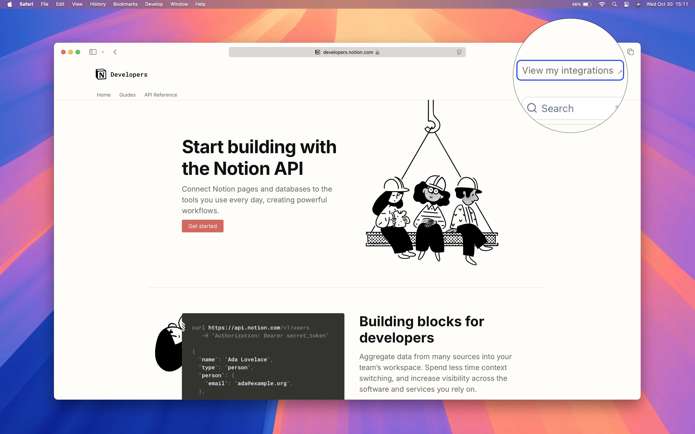
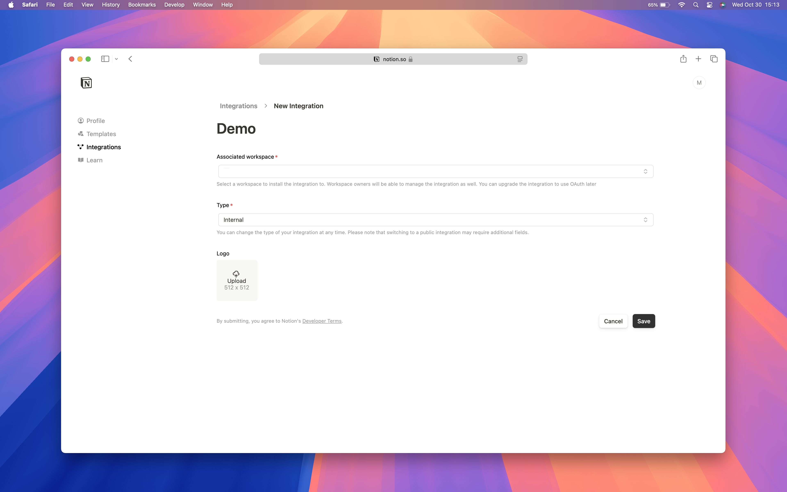
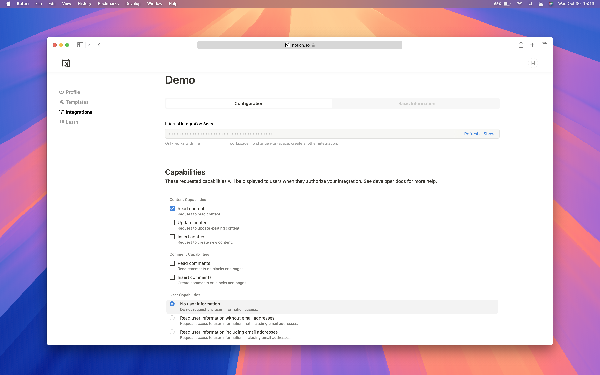
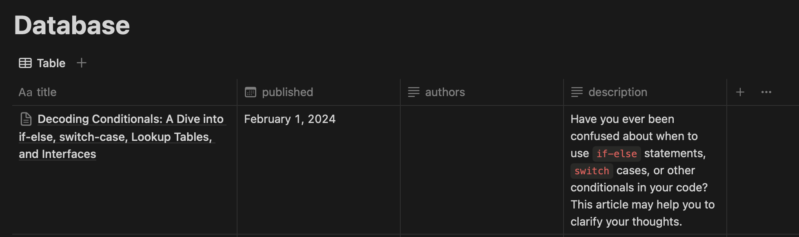

<!-- markdownlint-disable MD033 -->

# powerium.io

Thank you for stopping by. This is the repository that powers
[powerium.io](https://www.powerium.io), my blog site.

It's designed with performance in mind. Although not as performant as intended,
yet, I'm actively trying to optimize every single tiny bit of the code.

Feel free to open an issue or a PR if you would like.

## Tech Stack

- Framework: [Next.js (App Router)](https://nextjs.org)
- Styling: [Tailwind CSS](https://tailwindcss.com)
- CMS: [Notion](https://www.notion.so)
- Component Library: [shadcn/ui](https://ui.shadcn.com)
- Hosting: [Vercel](https://vercel.com/)

## Supported Notion Blocks

For an exhaustive list of all types of Notion blocks, please refer to their
[documentation](https://developers.notion.com/reference/block).

For the types of blocks that are supported, please check
[`/components/notion-engine`](./components/notion-engine/).

## Preview

| Home                                                                                                       | Blog Post                                                                                                                                                                                                                                                                                                         |
| :--------------------------------------------------------------------------------------------------------- | :---------------------------------------------------------------------------------------------------------------------------------------------------------------------------------------------------------------------------------------------------------------------------------------------------------------- |
| [](https://www.powerium.io) | [](https://www.powerium.io/blog/2024/02/01/decoding-conditionals-a-dive-into-if-else-switch-case-lookup-tables-and-interfaces) |

Above are snapshots of [powerium.io](https://www.powerium.io) at this very
moment. It's deployed straight from `main`, without any hidden magic.

## Getting Started

### Creating a Notion Integration

The site relies on a Notion integration to fetch data.

To create one:

<ol>
  <li>
    Go to <a href='https://developers.notion.com'>developers.notion.com</a>, and click on <i>View my integrations</i> in the top right corner.
    
  </li>
  <li>
    In <i>Integrations</i>, create a new integration.
    
  </li>
  <li>
    Fill in the details and save.
    <table>
      <tbody>
        <tr>
          <th>Associated workspace</th>
          <td>The workspace you would like to keep the blog database in. The database properties are described in later sections.</td>
        </tr>
        <tr>
          <th>Type</th>
          <td>Internal</td>
        </tr>
      </tbody>
    </table>
    
  </li>
  <li>
    Final bits to set up the integration.
    <table>
      <tbody>
        <tr>
          <th>Internal Integration Secret</th>
          <td>This will be <code>notionApiKey</code>.</td>
        </tr>
        <tr>
          <th>Content Capabilities</th>
          <td>
            Read content
          </td>
        </tr>
        <tr>
          <th>User Capabilities</th>
          <td>
            No user information
          </td>
        </tr>
      </tbody>
    </table>
    
  </li>
</ol>

### Setting Up the Blog Database

Create a Notion database with the following properties:

<!-- prettier-ignore -->
> [!TIP]
> The property names are case-sensitive.

| Name          | Type  | Description                                                                                                                      |
| :------------ | :---- | :------------------------------------------------------------------------------------------------------------------------------- |
| `title`       | Title | Title of the blog post.                                                                                                          |
| `published`   | Date  | Date of publication. Only posts that have a publication date prior to current date will be fetched. A 404 is returned otherwise. |
| `authors`     | Text  | Authors of the blog post, if different from what you define later in site configuration.                                         |
| `description` | Text  | Description of the blog post. Will be used as the meta description of the page.                                                  |



Install the integration you just created to the database.

Please follow
[_Add connections to pages_](https://www.notion.so/help/add-and-manage-connections-with-the-api#add-connections-to-pages).

### Configuring the Site

All configurations are in files under [`/config`](./config).

#### `/config/notion.ts`

<!-- prettier-ignore -->
> [!TIP]
> Please remove the existing `customPages` from `/config/notion.ts` if you don't
> intend to keep them.

| Key                | Description                                                                                                                                                                      |
| :----------------- | :------------------------------------------------------------------------------------------------------------------------------------------------------------------------------- |
| `notionApiKey`     | Secret of the Notion integration you created previously.                                                                                                                         |
| `notionDatabaseId` | ID of the blog database you created previously. For where to locate the value, please visit [Notion API Reference](https://developers.notion.com/reference/retrieve-a-database). |
| `cacheTtl`         | Time-to-live of the cache in seconds. All database queries are cached. Check [`lib/notion/server.ts`](./lib/notion/server.ts) for details.                                       |
| `customPages?`     | Pages you want to make available that are not in the database. They will show up in the nav bar. Make sure you install the integration to these pages as well.                   |

#### `/config/site.ts`

| Key                    | Description                                                                                                                                         |
| :--------------------- | :-------------------------------------------------------------------------------------------------------------------------------------------------- |
| `url.protocol`         | Protocol of the site.                                                                                                                               |
| `url.hostname`         | Hostname of the site.                                                                                                                               |
| `url.origin`           | Origin of the site.                                                                                                                                 |
| `metadata.author`      | Default authorship information of site and posts.                                                                                                   |
| `metadata.title`       | Title of the site.                                                                                                                                  |
| `metadata.description` | Description of the site.                                                                                                                            |
| `metadata.keywords?`   | Keywords of the site.                                                                                                                               |
| `metadata.icons?`      | Favicon of the site. Please check [Next.js Docs](https://nextjs.org/docs/app/api-reference/functions/generate-metadata#icons) for more information. |
| `githubRepository?`    | GitHub repository where the source of the site resides.                                                                                             |

#### Favicon

Please go to [this site](https://realfavicongenerator.net/favicon/nextjs) to
generate the favicon for the site. Guide is also provided there.

## Running a Local Development Server

<!-- prettier-ignore -->
> [!TIP]
> This site is developed using [bun](https://bun.sh). Please run the dev server
> with `bun` in case of any issues.

1. Create a new integration and database for development purposes.
2. Add the environment variables to
   [`.env.local`](https://nextjs.org/docs/app/building-your-application/configuring/environment-variables).
3. Run the development server:

```zsh
npm run dev
# or
yarn dev
# or
pnpm dev
# or
bun dev
```

## Deploying with Vercel

[](https://vercel.com/new/clone?repository-url=https%3A%2F%2Fgithub.com%2Fpowersagitar%2Fpowerium.io&env=NOTION_API_KEY,NOTION_DATABASE_ID&envDescription=As%20described%20in%20README.md&envLink=https%3A%2F%2Fgithub.com%2Fpowersagitar%2Fpowerium.io%2Fblob%2Fmain%2FREADME.md)
